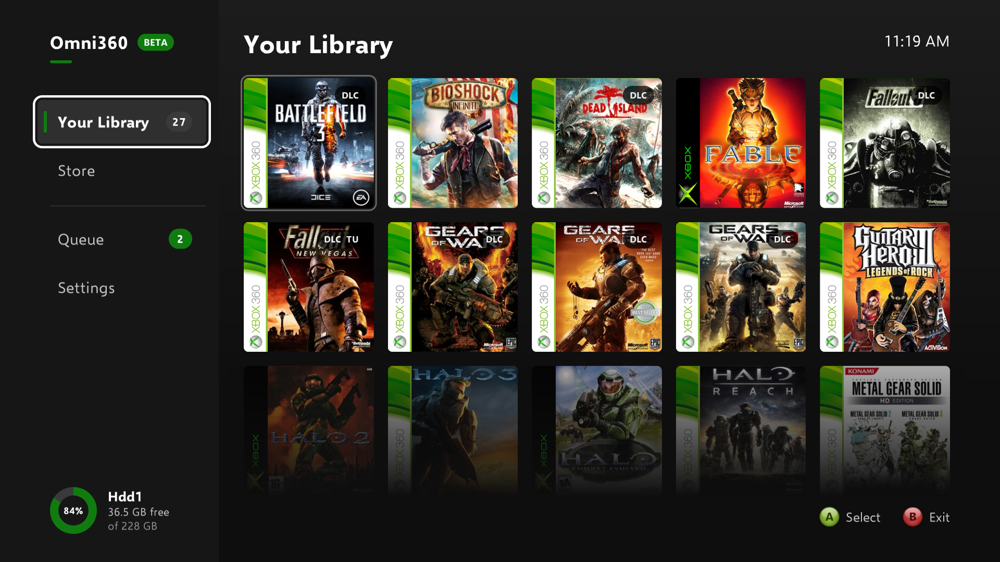
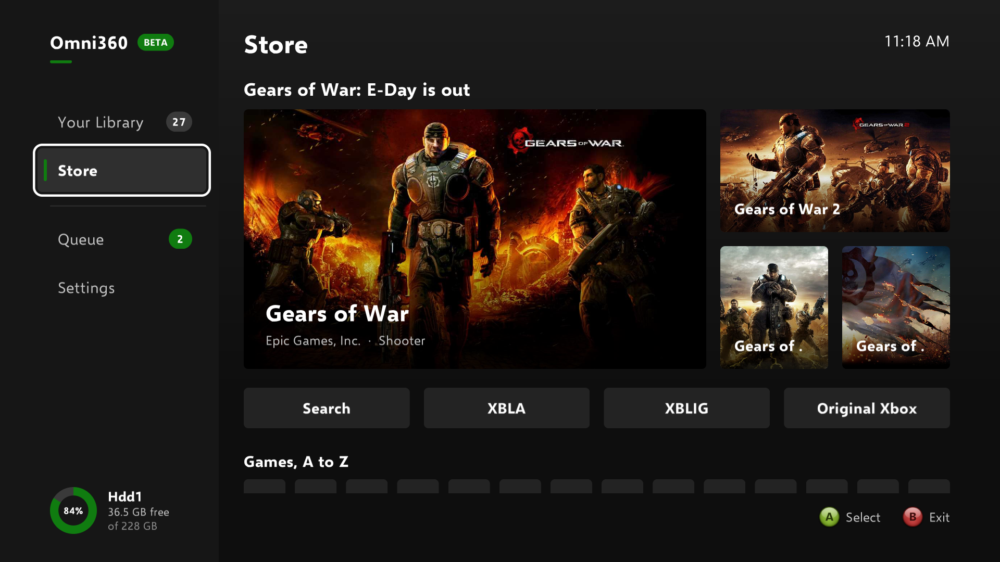
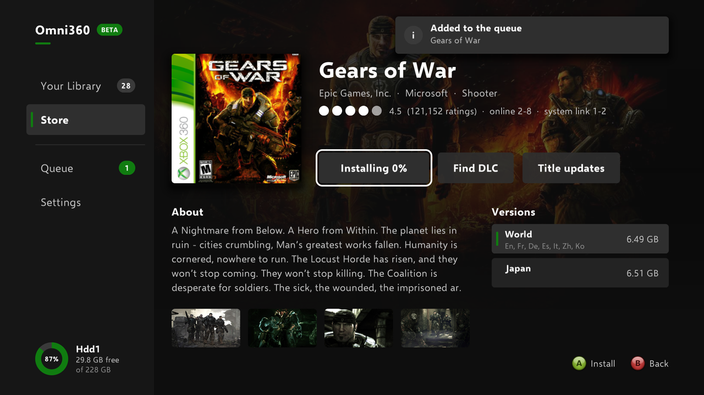
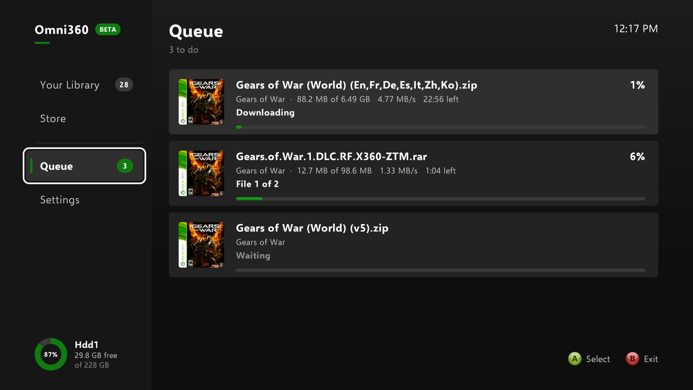

# Omni360

A homebrew Xbox 360 app for getting games and their extras onto a modded console, with no PC needed once it's set up:

- **Your Library** — your installed games as a grid of covers, read straight from the hard drive: Games on Demand and arcade packages, and games kept as extracted folders (`default.xex` or `default.xbe`) in any library folder.
- **Store** — about 1,500 Xbox 360 disc games from archive.org, A to Z, each with its own page: wallpaper, description, screenshots and its regional versions. Install one and it downloads and installs as Games on Demand, playable from the dashboard or Aurora without the disc.
- **Xbox Live Arcade** — about 740 arcade games from archive.org's `XBOX_360_XBLA` collection, A to Z, installed straight into the console's content folder.
- **Xbox Live Indie Games** — about 3,450 indie games from archive.org's `XBOX_360_XBLIG` collections, A to Z. The update indie games need to start on a console offline from Xbox Live is installed with the first one.
- **Original Xbox** — about 500 Original Xbox games the 360 can play, from archive.org's Redump collections, installed as Games on Demand. The 360's backward compatibility files need to be on the console.
- **DLC and title updates** for any game, from archive.org's `msx360gcdlc` and `microsoft_xbox360_title-updates` collections, installed where the console expects them.
- **Disc installs** — a game disc in the drive, Xbox 360 or Original Xbox, can be copied to the hard drive as Games on Demand.
- **Queue** — everything downloads and installs in the background while you carry on browsing.

<table>
  <tr>
    <td></td>
    <td></td>
  </tr>
  <tr>
    <td align="center"><b>Your Library</b> — your installed games, with their DLC and updates marked</td>
    <td align="center"><b>Store</b> — Xbox 360 games from archive.org</td>
  </tr>
  <tr>
    <td></td>
    <td></td>
  </tr>
  <tr>
    <td align="center"><b>A game's page</b> — details, screenshots and every version</td>
    <td align="center"><b>Queue</b> — downloads and installs, in the background</td>
  </tr>
</table>

Omni360 began as a fork of [X-Store](https://github.com/951261/X-Store) by 951261, and still runs on its networking core: the HTTPS client and BearSSL/TLS wrapper, DNS lookups and drive mounting. Everything Vimm's Lair/full-game/ISO/updater-related has been stripped out; the library, the Store, the installers and the interface are new. See `docs/` for X-Store's own original architecture notes (still accurate for the networking layer this fork builds on).

**Status: beta (0.5.0-beta), working on real hardware.** Installs from the Store, Xbox Live Arcade, Xbox Live Indie Games, Original Xbox, DLC, title updates and disc installs have all been run end to end on a modded console with a real library.

## Using it

The sidebar on the left has four pages; left on the D-pad reaches it from any page, and **B** steps back a level (B on the sidebar exits).

- **Your Library** — **A** on a game opens its page. A game disc in the drive is the first tile: **A** installs it to the hard drive, **X** opens its page, and once it's installed **A** finds its DLC and **START** installs it again. **Y** is a shortcut to Settings.
- **Store** — three featured games, then A to Z. **A** on a letter shows its games; **A** on a game opens its page. **XBLA**, **XBLIG** and **Original Xbox** open their own A to Z. Search is on the way, marked SOON.
- **A game's page** — **Install** installs the chosen version, every disc of it; choose another version from the list beside the description first. The button shows Queued, Installing, Installed, or Install remaining for a multi-disc game partly installed. **Find DLC** and **Title updates** search archive.org and show what's there to pick from. **Uninstall** appears once something is installed, and removes the game but leaves its DLC and title updates.
- **Queue** — what's downloading, waiting and done. **X** stops a download or install, or clears a finished one.
- **Settings** — the games folder and more library folders, your archive.org keys, the disc read speed (lower it for a scratched disc that fails partway through), and updates: Omni360 checks GitHub for a newer version when it starts (this can be turned off), shows what's new in it, and installs it and restarts when you choose Update. It only installs a release signed with the project's key (`tools/sign_release.py`), keeping the previous version beside it as `.old`.

Nothing downloads without you choosing it, and a popup says when each job finishes or fails.

## Requirements

- A soft-modded (BadUpdate, ABadAvatar) or hard-modded (RGH, JTAG) Xbox 360, connected to the internet. Ethernet is recommended.
- An archive.org account, and its IAS3 access key and secret key. Every collection Omni360 downloads from is marked private, so archive.org refuses downloads without them.
- Free space for installing games: the download and the installed game both, while it installs — around 7GB plus 3-8GB for a typical game. The download is removed once it's installed.
- To build it yourself: the official Microsoft Xbox 360 XDK and Visual Studio 2010 (`XboxTLS2.vcxproj` targets `Platform=Xbox 360` directly — this is **not** buildable with the open free60/libxenon toolchain). Sourcing the XDK is on you. See `COMPILING.md`, and `RELEASING.md` for publishing a version people can update to.

## Setup

See [`docs/Setup Guide.md`](docs/Setup%20Guide.md) for the whole thing. In short:

1. Get `Omni360.xex` — a release build, or build `XboxTLS2.vcxproj` (Release) from `Omni360.sln`.
2. Get your archive.org keys at [archive.org/account/s3.php](https://archive.org/account/s3.php), logged in with your normal account. These are archive.org's official script-friendly credentials, the same pair their `ia` tool uses — not your password. Put them in a plain text file, `ArchiveOrgKeys.txt`, access key on line 1 and secret key on line 2. (Or type them in on the console, in Settings — painful with a controller, but it works.)
3. Copy `Omni360.xex` and `ArchiveOrgKeys.txt` into a folder of their own on the console, and launch it.

Two optional `settings.txt` keys change where things go, and the games folder can also be changed on the console in Settings:

- `games-path:` — where games install, and where the library is scanned. Defaults to `Hdd1:\Content\0000000000000000`, where the dashboard keeps Games on Demand and arcade titles. Add more `games-path:` lines to scan more folders, such as `Usb0:\Content\0000000000000000` — the first is still where games install. See the Setup Guide.
- `xbla-path:` — where DLC, title updates, arcade games and indie games are written. Same default. (The name is inherited from X-Store, which used the same key.)

## How it works

**The library** walks `{games folder}\{TitleID}\{ContentType}\*` and reads each title's ID, name and icon out of its STFS package header (`StfsParser.cpp`) — entirely offline. Covers come from xboxunity.net, or Xbox Live's box art where xboxunity has none, and are cached in `game:\Covers` (`CoverArt.cpp`).

**The Store's games are compiled in.** `tools/make_store_titles.py` builds `StoreTitles.h` from archive.org's Redump collection (the `microsoft_xbox360_*` items, one zip per disc), with title IDs from Redump's own datfile — a disc's serial *is* its title ID: "MW-2004" is publisher code `MW` (0x4D57) and title 2004 (0x07D4). It adds games the Redump collection lacks from the `XBOX_360_2` to `_6` set, gathers each game's discs into games and versions, and writes their labels, so the console only reads tables. Wallpapers, screenshots, descriptions and ratings come from Xbox Live's servers over plain HTTP (`HttpPlain.cpp`), and are cached in `game:\Store` (`StoreArt.cpp`).

**Installing a game** (`GameInstaller.cpp`) downloads the disc's zip in 32MB pieces over two connections, from whichever of archive.org's servers holding it is fastest. archive.org stalls both connections about once a minute, so a connection that goes silent for 10 seconds, or slows below 0.5MB/s, is dropped and its piece resumed where it stopped; one server failing repeatedly moves the download to the next. As the pieces land, the disc image is decompressed once to check its CRC and to note restart points; then it's converted to Games on Demand (`GodConvert.cpp`) straight out of the zip, so the 7-8GB image is never written out — only the parts of the disc the game uses, typically 3-7GB. The package gets the game's icon from Xbox Live. Each install is noted in `game:\Store\Installed.txt`, with the disc's media ID, so the Store can tell which disc of a multi-disc game is installed. A typical game takes 30-40 minutes to download and 5-10 to install.

**DLC and title updates** (`ArchiveOrgDLC.cpp`, `DownloadQueue.cpp`) send your keys as an `Authorization: LOW <access>:<secret>` header, look the game up by name in the collection's metadata, then read each matching archive's file table with a few small `Range` requests: RAR interleaves headers with each file's data, so that walks the chain one entry at a time; ZIP keeps a central directory at the tail, so one request covers it. Each file is downloaded through archive.org's `/download/{item}/{archive}/{path}` form, which serves the member already extracted, and written where the console expects it: DLC by its own `TitleID\ContentType\ContentID` path, lowercase `tu...` updates into `Content\0000000000000000\{TitleID}\000B0000\`, and uppercase `TU_...` updates into `{device}\Cache\`. Avatar-item packs (content type `00009000`) are filtered out.

**Disc installs** (`DiscWorker.cpp`) watch the tray, read the disc that goes in, and convert it to Games on Demand the same way, reading ahead from the drive at full speed (or the speed set in Settings). An Original Xbox disc is read only where its files are, as the 360's drive refuses its security ranges.

## Known limitations

- **Downloads are slow-ish** — about 3.5MB/s on average, so a game takes half an hour or more. archive.org's servers are the limit, not the console.
- **Some games aren't in the Store.** Games only archived as RARs (in `XBOX_360_1`, such as Crackdown and the Dirt series) aren't listed, as the installer reads zips only; a few dozen more aren't on archive.org in either set.
- **An interrupted game install starts over.** Pieces resume within a session, but quitting the app mid-download removes what was downloaded.
- **A multi-disc game installed some other way** — from real discs, or another tool — can't be uninstalled by version from its Store page, since Omni360 can't tell which disc is which. Its own library entry still can be, if the Store hasn't got it.
- **Key entry** on the on-screen keyboard isn't masked.
- **DLC matching is deliberately loose** — it has to cope with release-group names like `Halo.1.Combat.Evolved.Anniversary...` and abbreviated display names like `CoD: World at War`. It scores candidates 0-100 on how much of the game's name appears in the filename, and penalises a missing number heavily so "Halo 3" doesn't offer "Halo 4". You always confirm the pack yourself.
- **Display names** are decoded as UTF-8 or UTF-16BE, whichever each package turns out to use; characters outside the BMP become `?`.
- The `.vcxproj.filters` file still lists X-Store's old folder groupings (Solution Explorer only; it doesn't affect the build).

## Why this exists instead of just using X-Store or Aurora

- **An Aurora Lua script** got further than expected, but Aurora's `Http` library doesn't keep cookies between requests and can't attach custom headers — confirmed on hardware — and archive.org's login wall needs both.
- **X-Store as-is** (pointed at Vimm's Lair) broke with `404`s from Vimm's own anti-scraping measures.

A native `.xex` was the only option with full control over HTTP requests.

## License

AGPL-3.0, inherited from the original X-Store project (see `LICENSE`). Vendored components keep their own licenses: BearSSL (`SSL/`, MIT), zlib (`zlib/`, zlib license), cJSON (`cJSON.c/.h`, MIT), the Selawik font (OFL). A modified version you distribute must stay under AGPL-3.0 with copyright notices preserved and source available to anyone you give the binary to.

### Credits

Omni360 is a modified version of [X-Store](https://github.com/951261/X-Store) by 951261, released under AGPL-3.0; this section is its notice that it has been modified (AGPL-3.0 section 5(a)). Most of the application has since been rewritten, but X-Store's code is still at its foundation: the TLS wrapper around BearSSL (`XboxTLS.cpp/.h`), the HTTPS client (`downloadFile.cpp`), DNS (`dns.cpp`), URL and text helpers (`parsing.cpp`), drive mounting (`driveMount.c`), the log console (`OutputConsole.cpp`) and the on-screen keyboard (`Keyboard.cpp`). Several of those files carry `PROGRAMMER : 951261` headers. Those headers are copyright notices, and AGPL-3.0 requires them to survive - rename the product as much as you like, but leave them, and this section, in place.

Game data comes from [Redump](http://redump.org) (title IDs, by disc serial), [xboxunity.net](https://xboxunity.net) (covers) and Xbox Live's own servers (art, details and icons); the games themselves from the archive.org collections named above.

Built with [BearSSL](https://bearssl.org) (TLS), [zlib](https://zlib.net) (inflate), [cJSON](https://github.com/DaveGamble/cJSON) (JSON) and [stb_image](https://github.com/nothings/stb) (JPEG and PNG decoding, public domain).
